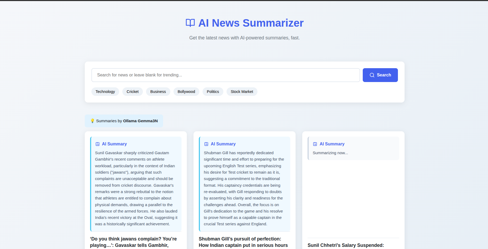

# AI News Summarizer 🚀

A dynamic web application that fetches the latest news from Google News, uses Large Language Models (LLMs) for summarization, and displays the results in a modern, responsive interface. The application features a non-blocking background task queue to process summaries, with on-screen articles being prioritized for a seamless user experience.



## Key Features ✨

-   **Dual LLM Support:** Easily switch between a local [Ollama](https://ollama.com/) instance (e.g., using Gemma, Llama3) and the cloud-based Google Gemini API.
-   **Live News Feed:** Fetches trending news from India or search results for any user-defined topic.
-   **Background Processing:** Summarization tasks are handled by a dedicated background thread, ensuring the UI remains fast and responsive.
-   **Priority Queue:** Intelligently prioritizes summarizing articles that are currently visible to the user.
-   **Persistent Caching:** Uses a SQLite database to cache news articles and summaries, improving performance and data integrity.
-   **Time-To-Live (TTL) Cache:** Automatically fetches fresh news for a topic if the cached data is older than 15 minutes, ensuring content stays relevant.
-   **Dynamic UI:** The frontend automatically polls for completed summaries and updates the view without requiring a page refresh.
-   **Modern & Responsive:** Built with clean HTML, modern CSS, and vanilla JavaScript for a fast, accessible experience on any device.

## Technology Stack ⚙️

-   **Backend:** Python 3, Flask
-   **LLM Integration:** `ollama`, `google-generativeai`
-   **Data Fetching:** `feedparser`
-   **Database:** SQLite 3 (via Python's `sqlite3` module)
-   **Environment Management:** `python-dotenv`
-   **Frontend:** HTML5, CSS3, Vanilla JavaScript (Fetch API, DOM Manipulation)

---

## Setup and Installation 🔧

Follow these steps to get the application running on your local machine.

### 1. Prerequisites

-   Python 3.8+
-   (Optional) [Ollama](https://ollama.com/) installed and running if you plan to use it as an AI provider.

### 2. Clone the Repository

```bash
git clone <your-repository-url>
cd AI-News-Summarizer
```

### 3. Set Up a Virtual Environment

It's highly recommended to use a virtual environment to manage dependencies.

```bash
# Create the virtual environment
python3 -m venv venv

# Activate it (on Linux/macOS)
source venv/bin/activate

# On Windows, use:
# venv\Scripts\activate
```

### 4. Install Dependencies

Create a file named `requirements.txt` in the project root with the following content:

```
# requirements.txt
flask
feedparser
python-dotenv
google-generativeai
ollama
```

Now, install these packages using pip:

```bash
pip install -r requirements.txt
```

### 5. Configure Your Environment

Create a file named `.env` in the project root. You can copy the example below and fill in your details.

```env
# .env file

# --- AI Provider Selection ---
# Choose your AI provider. Use "google" or "ollama".
AI_PROVIDER="ollama"


# --- Google AI Configuration ---
# Required if AI_PROVIDER is "google".
# Get your API key from Google AI Studio: https://aistudio.google.com/app/apikey
GOOGLE_API_KEY="YOUR_GOOGLE_API_KEY_HERE"
GOOGLE_MODEL="gemini-1.5-flash"


# --- Ollama Configuration ---
# Required if AI_PROVIDER is "ollama".
# Make sure your Ollama instance is running.
OLLAMA_MODEL="gemma3n"
```

**Important:** If using Ollama, ensure you have pulled the model you specify in the `.env` file. For example:
`ollama pull gemma3n`

---

## Running the Application ▶️

With your virtual environment activated and your `.env` file configured, start the Flask server:

```bash
python3 app.py
```

The server will start, initialize the database (`news.db` will be created), and launch the background threads.

You can now access the application in your web browser at:
**[http://127.0.0.1:5000](http://127.0.0.1:5000)**

## How It Works 💡

The application is composed of several key components working together:

1.  **Flask Web Server:** Handles incoming HTTP requests. It serves the main `index.html` page and provides a `/get-news` API endpoint.
2.  **SQLite Database (`news.db`):** Acts as the single source of truth. It stores all fetched articles, their metadata, and their summarization status (`pending`, `in_progress`, `done`, `error`).
3.  **Startup Thread:** When the app starts, this thread runs once to initialize the database and reset any summaries that were stuck `in_progress` from a previous run. It also warms up the Ollama model if selected.
4.  **Background Summarizer Thread:** This is the application's workhorse. It runs continuously in a loop:
    -   It first checks a high-priority in-memory queue for articles that the user is currently viewing.
    -   If the priority queue is empty, it queries the database for any article with a `pending` status.
    -   It processes one article at a time, calling the selected LLM and updating the database with the result.
5.  **Frontend JavaScript:** The client-side code fetches news from the `/get-news` endpoint, renders the article cards, and then polls periodically to check for and display newly completed summaries.

## Project Structure 📁

```
/AI-News-Summarizer
|-- app.py              # The main Flask application backend
|-- templates/
|   |-- index.html      # The single HTML file for the user interface
|-- .env                # Your local configuration file (secret)
|-- news.db             # The SQLite database (created on first run)
|-- requirements.txt    # Python dependencies
|-- README.md           # This file
```
